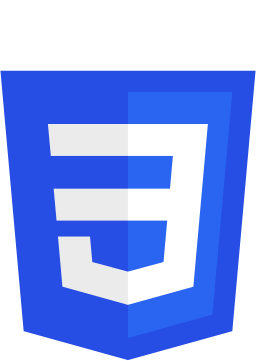

<h1 align="center">
    Hello
    , I'm Mitali Pilankar    
</h1>
<h3 align="center">A Passionate Frontend Developer from India</h3>

    
    
    

  

<h3 align="left" style="font-weight:600; "> 🙋🏻 About Me:</h3>

- 🏆 I'm Proficient in **HTML, Bootstrap, Java, Django, .NET** 

- ✉️ You can reach me at **pilankar.mitali07@gmail.com**

- 👨‍💻 All of my projects are available at [https://pilankar.github.io/Portfolio/](https://pilankar.github.io/Portfolio/)

- 🎓 Know more about my expreriences **[Resume](https://drive.google.com/file/d/1Wvt919xtzBV5HzLYEmAIqtP3S8ELrdgR/view)**

- 🎯 I’m currently learning **Node.js** 

---

<h3 align="left" style="font-weight:600; ">💻 Frontend Development:</h3>

    
    
    
    

<h3 align="left" style="font-weight:600; ">📖 Programming Languages:</h3>

    
    
    
    
    

<h3 align="left" style="font-weight:600; ">🛢 Databases:</h3>

    
    
    

<h3 align="left" style="font-weight:600; ">🛠️ Frameworks and Tools:</h3>

     
    
    

---

<h3 align="left" style="font-weight:600; "> 📊 My Stats:</h3>
 

    

